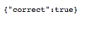
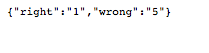
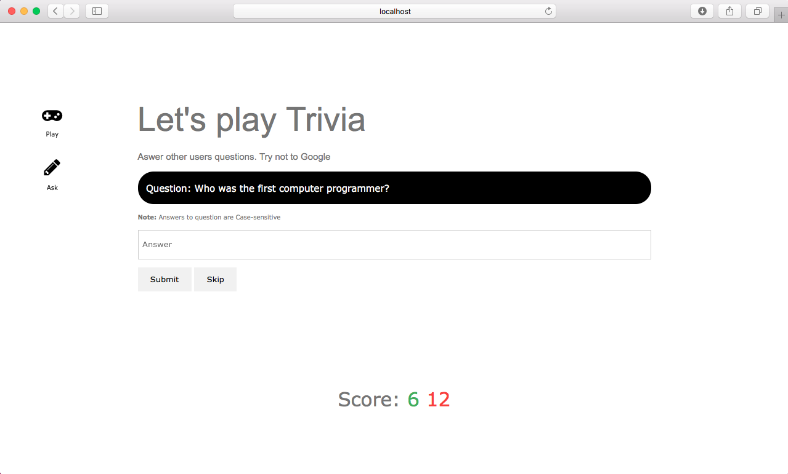

# Web-Service-API-online-trivia-game
CPSC 473 assignment 4

## Tools:

- Node.js
- Express.js
- Body-parser
- MongoDB
- Redis

## Installation:
 1.- Type in Terminal: npm install  to install all of the dependencies
```
$ npm install
```
 2.- Start Redis
````
$ $HOME/redis/src/redis-server
````

 3.- Start MongoDB
````
$ mkdir -p $HOME/mongodb/data
$ $HOME/mongodb/bin/mongod --dbpath=$HOME/mongodb/data
````

 4.- Run Web Api and app
 ````
$ node server.js
````

4.- Access
Go to browser and type localhost:3000

## Sample API 
###response:
/question
 

/answer
 

/score
 

## Web app 
###Play Trivia
 
###Add questions to trivia
 


assignment5
